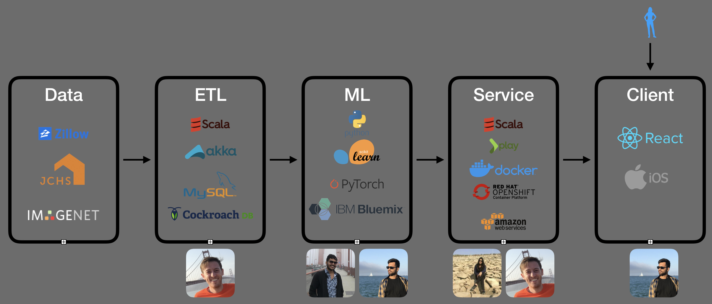

# Rinnovation

Optimize Your Home Renovation

## Abstract

Whether you're a young couple moving into your first home or a seasoned property manager, you might be asking yourself, "How do I turn this *fixer-upper* into a *dream home*?". We're here to help. We will build Rinnovation: a way for you to ensure your renovation projects yield optimal results. Whether you're focused on time, cost, or ROI, we empower you to make the best decision based on local and global trends.
 
Answer questions such as:
* Which room should I update?
* How much should I invest?
* Who should I trust to get the job done on-time?

By leveraging data from other renovations, we can predict how much your project is likely to cost, how long it will take, and the ROI. Rinnovation never stops learning. Whether the current trend is bamboo flooring or balconies, you'll know about it first.

### Enterprise Customers

For corporate property managers, our enterprise solution yields even more insight. We will integrate with your existing tools like [PlanGrid](https://www.plangrid.com) to provide you real-time alerts when we can confidently predict that a project's schedule will be impacted. After all, time is money.

Maybe you own a rental property and need to know how to develop it. Perhaps you're operating a venture capital-backed startup (i.e. [Opendoor](https://www.curbed.com/2019/3/21/18252048/real-estate-house-flipping-zillow-ibuyer-opendoor), Zillow, etc.) gobbling up millions of dollars of real estate. No matter the size of your business, we want to see your projects succeed. Rinnovation keeps up with the high-velocity, large-scale nature of your work. Reduce risk and proceed more confidently with Rinnovation.

## Design Thinking

### Homeowner

Who: A homeowner

What: can explore predicted returns for various home renovations 

Wow: independently, immediately, and with city-level insight into local market trends.

### Home Buyer

Who: A home buyer

What: can factor in locale-specific renovation ROI prior to purchasing a property

Wow: so they can make their purchase more confidently, avoiding false assumptions.

### iBuyer Operations Managers

Who: iBuyer operations managers

What: can automate their renovation projects using our API

Wow: so that informed purchasing decisions are built-in to their business processes, thereby reducing risk & costs.

## Architecture

## Technology

### Data

* [Zillow](https://www.zillow.com/research/data): This data will be used to train our ML models on locale-specific renovation metrics.
* [Joint Center for Housing Studies: Demographic Change and the Remodeling Outlook](https://www.jchs.harvard.edu/research-areas/reports/demographic-change-and-remodeling-outlook): This data is more limited, but has some historic trends which may be useful.
* [Image-Net](http://image-net.org/about-overview): Image-Net has a large repository of images which we can use for deep learning/computer vision training tasks (i.e. generating pictures of rooms).

### ETL

* [Akka](https://akka.io): We will use some portion of Akka for our ETL pipeline. Akka Streams will likely be sufficient, but it would be a fun challenge to try to use Akka Actors/Cluster and deploy it on a PaaS. To be determined.
* [CockroachDB](https://www.cockroachlabs.com): We're not fully committed to any database at this point. If scikit-learn, PyTorch, or any other ML framework we use is incompatible, we may switch to another (MySQL, Postgres, etc.). That being said, it would be fun to try out CockroachDB. I listened to an episode of Software Engineering Radio recently where the CockroachDB creator was the special guest; my interest was piqued then.

### Machine Learning

We will use whatever machine learning tool is best for the job. I am currently toying with [DCGANs using PyTorch](https://github.com/pytorch/examples/tree/master/dcgan). The approach is used to generate pictures of bedrooms based on a training set of bedroom images. It would be neat to use a similar approach to generate pictures of renovation project outcomes immediately for the customer.

* [scikit-learn](https://github.com/scikit-learn/scikit-learn): scikit-learn will be used to train a model which can predict ROI, time, and potentially other metrics for a potential renovation.
* [PyTorch](https://www.github.com/pytorch/pytorch): We expect to use PyTorch to do deep learning tasks on images from Image-Net. For instance, there is a paper describing how to generate pictures of rooms. If we can replicate and build upon that effort, we will consider that a success.
* [TensorFlow](https://www.github.com/tensorflow/tensorflow): Since TensorFlow 2 has been released recently, we may also experiment with it. Though, it's not at the top of our list currently.
* [How to Get Started with Machine Learning on Bluemix](https://dzone.com/articles/how-to-get-started-with-machine-learning-on-bluemi-1): We aim to train our models on a PaaS. This article describes how to get started with scikit-learn and Bluemix, so we will start there. We will likely also investigate other options to see what is the most effective training ground.

### Service

* [Play](https://www.playframework.com): We will use Play to build a small REST API for clients to retrieve answers from the ML models we produce.
* [Docker](https://github.com/docker): Docker will be used to containerize our service.
* [Kubernetes](https://github.com/kubernetes/kubernetes): We may use Kubernetes directly, but Professor Ranjan has mentioned OpenShift a few times; we may look there for portability.
* [Using AWS and OpenShift Together](https://blog.openshift.com/using-aws-openshift-together)

### Client

* [React](https://www.github.com/facebook/react): We will build the interface our client application with React. It will not be the primary focus for the project, but we will still make it nice.
* If time permits, it would also be fun to build a small iOS app that uses our models locally via CoreML as a proof-of-concept implementation of edge computing.

## Feedback

Professor Ranjan's initial reaction:
> From picture of the home, machine generates square footage of each structure in the home. you need a lot of data to train a CNN model. This will help predict cost and time of renovation. For some fixer upper houses, finding the right measurements without seeing it is impossible.

## Team

1. [Aditya Agrawal](https://github.com/agrawaladit)
2. [Andrew Selvia](https://github.com/AndrewSelvia)
3. [Kaustubh Kulkarni](https://github.com/kaustubhkulkarni1509)
4. [Pallavi Chaturvedi](https://github.com/pallavichaturvedi)
